# Memory Lane Booking Workflow and Audit Guide

**Purpose:** This booking workflow explains how to process every Memory Lane enquiry from first submission to completion. Use it as the operating guide for daily booking management, Free Portrait registrations, paid session follow up, and future audit checks.

**Applies to:**

- Family Session
- Couple Session
- Friends and Memories
- Portrait Session
- Small Event Coverage
- Free Portrait Session

**Main admin areas used:**

- Admin Dashboard
- Bookings tab
- Free Portrait tab
- View Details popup
- Internal Admin Notes
- Quoted Price
- Status dropdown

---

## 1. Full booking workflow overview

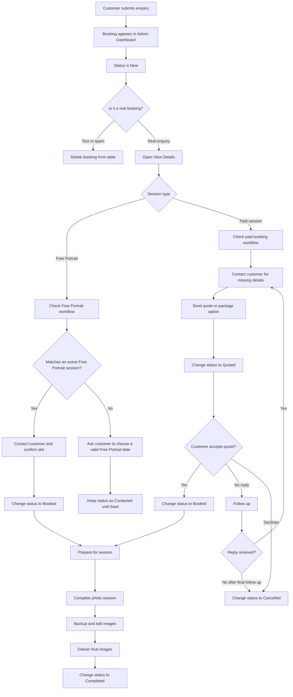

---

## 2. Booking status rules

Use status changes consistently. This is the main audit trail inside the dashboard.

| Status | Use this when | Required action |
|---|---|---|
| New | A booking has just arrived | Review and decide if it is real |
| Contacted | You have messaged, called, or emailed the customer | Add an internal note with contact method and date |
| Quoted | You sent a price or package option | Enter the quoted price |
| Booked | Customer confirmed the session | Add date, time, location, and final plan in notes |
| Completed | Session is finished and images have been delivered or are fully handled | Add final delivery note |
| Cancelled | Customer cancelled, did not reply, or booking was not suitable | Add reason in notes |

**Rule:** Do not leave real bookings as `New` after you have contacted the customer.

---

## 3. Daily booking handling process

Run this process every day.

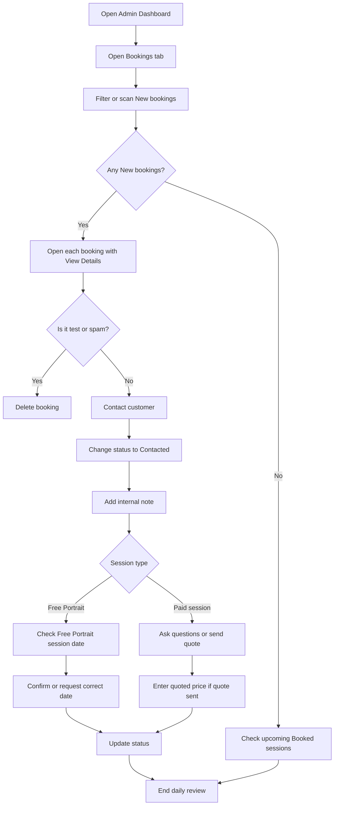

Daily checklist:

- [ ] Review all `New` bookings.
- [ ] Delete test or spam only.
- [ ] Contact every real new customer.
- [ ] Change status after action.
- [ ] Add internal notes.
- [ ] Enter quoted price for paid quotes.
- [ ] Check Free Portrait registrations against session dates.
- [ ] Review tomorrow and this week bookings.

---

## 4. Real booking triage

When a booking arrives, classify it first.

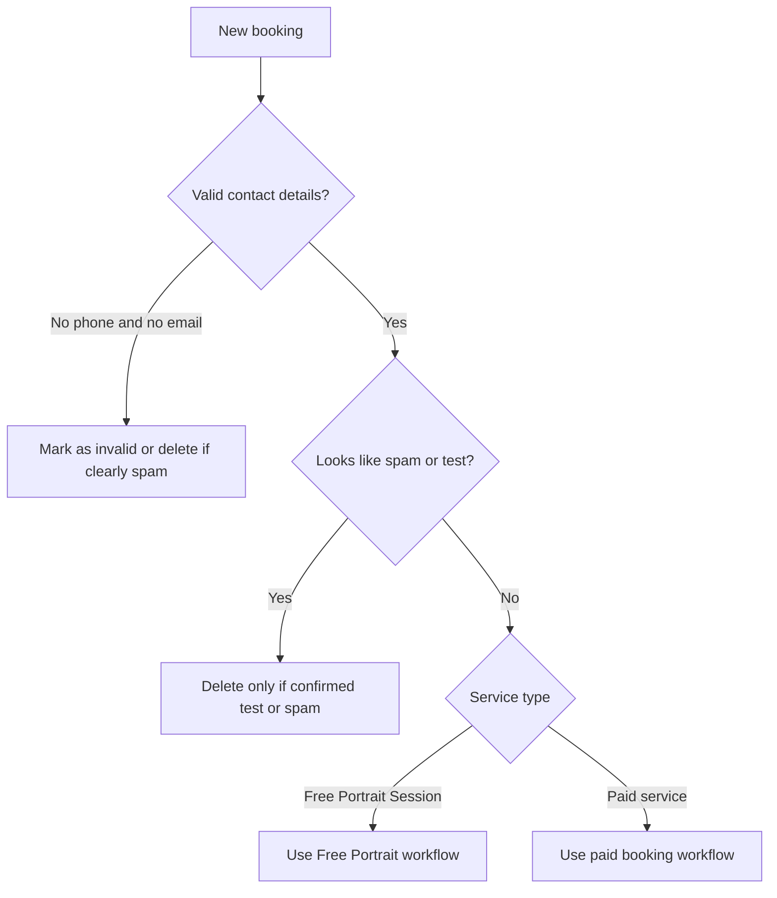

Check these fields:

| Field | What to check |
|---|---|
| Name | Looks real, not random test text |
| Phone | Usable Australian number if provided |
| Email | Looks valid |
| Service | Session type selected |
| Preferred Date | Customer selected a date |
| Message | Helps you understand what they want |
| Free Portrait Event ID | Should exist for Free Portrait bookings after the latest patch |

---

## 5. Paid session workflow

Use this for Family, Couple, Friends, Portrait, and Small Event bookings.

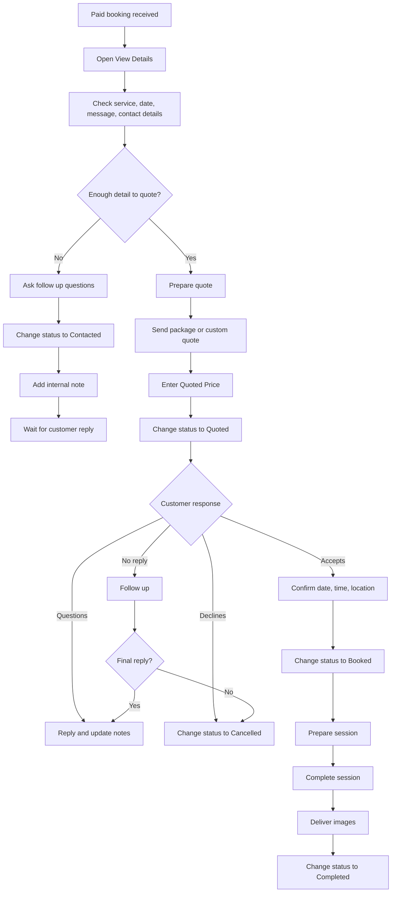

Ask these questions when details are missing:

- How many people will be photographed?
- What kind of photos do you want?
- Do you have a preferred location?
- Do you prefer morning, afternoon, or sunset?
- Is this for a special event or milestone?
- Do you need help choosing outfits?
- Do you need the photos by a specific date?

Internal note example:

```text
Contacted by email on 25 June. Customer wants a couple session at Glenelg, sunset preferred. Waiting for final date confirmation.
```

Quote note example:

```text
Quoted A$350 for Couple Session. Includes relaxed session, edited gallery, and Adelaide location guidance. Waiting for response.
```

Booked note example:

```text
Booked for 12 July, 4:30 pm at Glenelg. Couple session. Warm natural style requested. Customer confirmed by email.
```

---

## 6. Free Portrait workflow

Use this for Free Portrait registrations only.

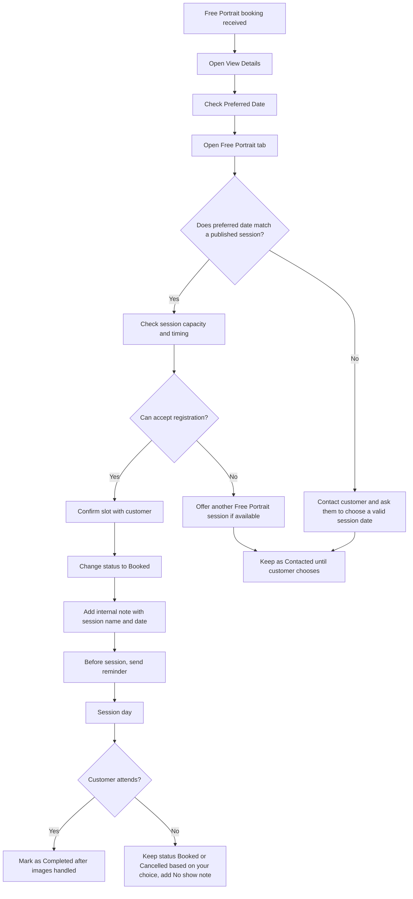

Free Portrait checks:

| Check | Expected result |
|---|---|
| Service type | Free Portrait Session |
| Preferred Date | Same date as one active Free Portrait session |
| Free Portrait Event ID | Linked to the correct session |
| Session status | Published or active |
| End time | Booking should relate to that session and be counted before the end time |
| Customer expectation | One individual portrait only |

Free Portrait internal note example:

```text
Free Portrait registration for 12 July session at Semaphore. Confirmed by email. Individual portrait only.
```

If date does not match:

```text
Customer selected Free Portrait but preferred date does not match an active session. Asked customer to choose one of the published dates.
```

If customer does not attend:

```text
No show for 12 July Free Portrait session. No images delivered.
```

---

## 7. Follow up process

Use this when a customer has not replied.

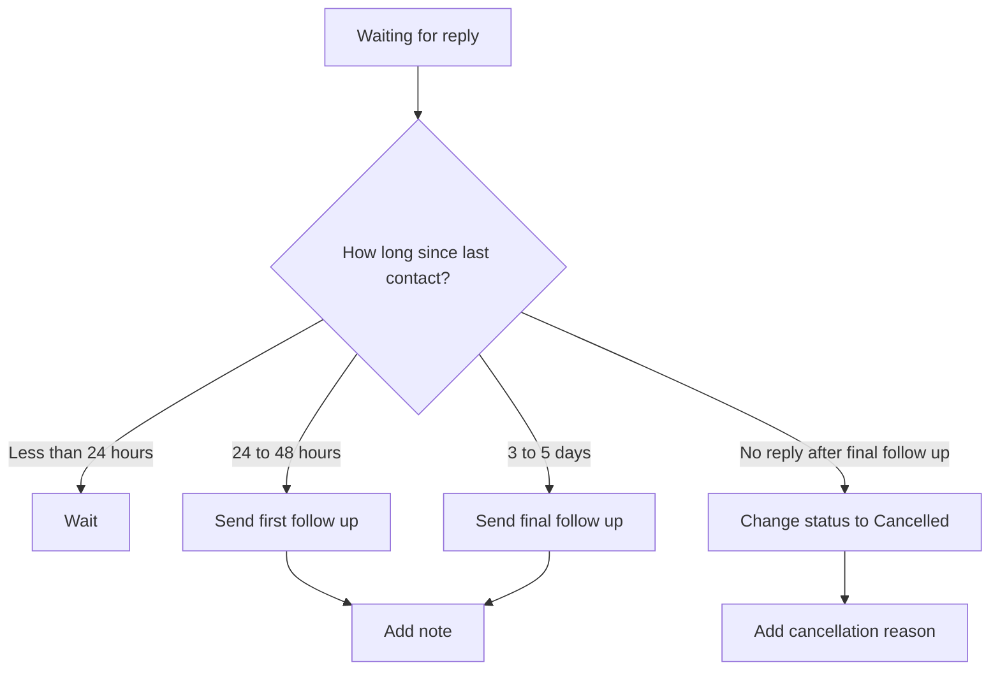

Recommended follow up timing:

| Stage | Timing | Action |
|---|---:|---|
| First contact | Same day as enquiry | Reply and change status to Contacted |
| First follow up | 24 to 48 hours later | Short reminder |
| Final follow up | 3 to 5 days later | Final check |
| Close booking | After no reply | Change to Cancelled |

Follow up note example:

```text
First follow up sent on 27 June. No response yet.
```

Cancellation note example:

```text
No reply after two follow ups. Marked as cancelled on 1 July.
```

---

## 8. Pre-session checklist

Use this once the booking is `Booked`.

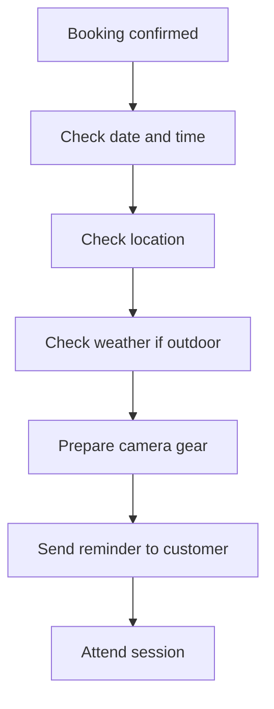

Checklist:

- [ ] Confirm date and time.
- [ ] Confirm location and meeting point.
- [ ] Save customer contact details.
- [ ] Check travel time.
- [ ] Check weather.
- [ ] Charge camera batteries.
- [ ] Format or prepare memory cards.
- [ ] Prepare lens and backup gear.
- [ ] Bring props or lighting if needed.
- [ ] Send reminder message.

Reminder note example:

```text
Reminder sent one day before session. Location and time confirmed.
```

---

## 9. Post-session workflow

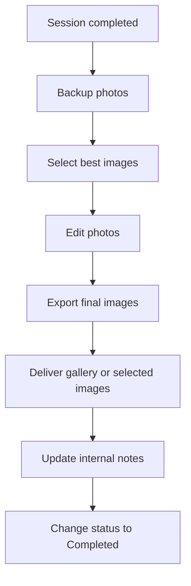

Post-session checklist:

- [ ] Backup images.
- [ ] Select best images.
- [ ] Edit selected photos.
- [ ] Export final files.
- [ ] Deliver images to customer.
- [ ] Add delivery note.
- [ ] Change status to Completed.

Completed note example:

```text
Session completed. Final edited images delivered by Google Drive on 15 July.
```

---

## 10. Delete rules

Only delete bookings when they should not be part of your business records.

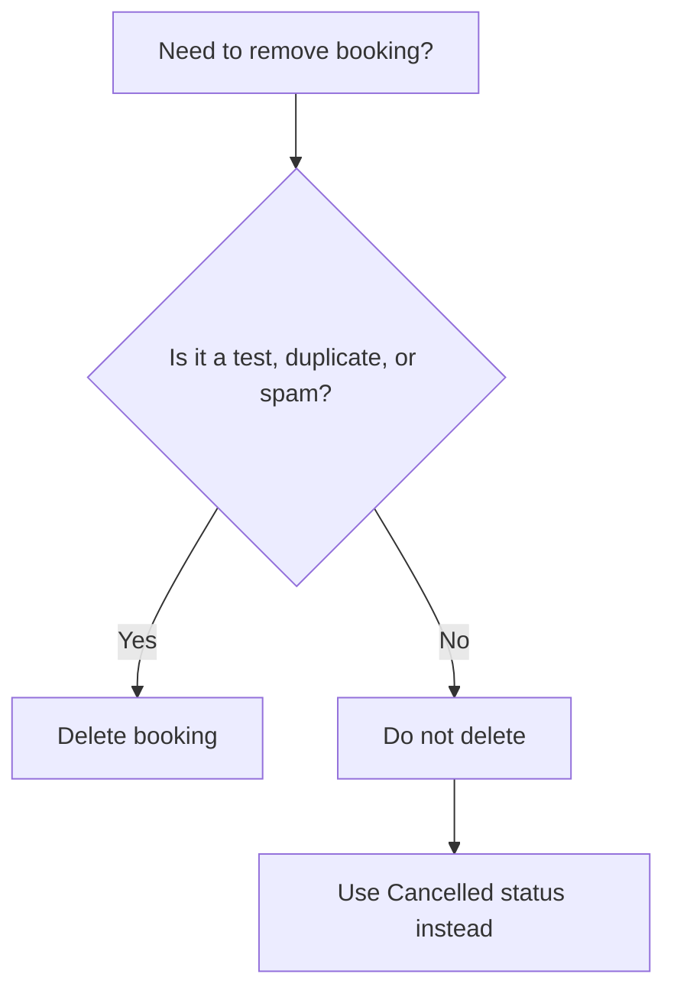

Delete only:

- Test submissions
- Obvious spam
- Duplicate booking created by mistake
- Mistyped test data from your own testing

Do not delete:

- Real customer enquiries
- Cancelled bookings
- No reply bookings
- No show bookings
- Completed bookings

**Audit rule:** For real bookings, use `Cancelled` instead of deleting. This keeps your enquiry history and conversion data accurate.

---

## 11. Weekly audit checklist

Run this once a week.

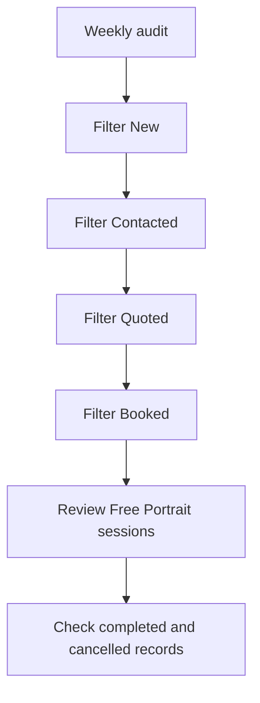

Checklist:

- [ ] No real bookings stuck in `New`.
- [ ] Every `Contacted` booking has an internal note.
- [ ] Every `Quoted` booking has a quoted price.
- [ ] Every `Booked` booking has date, time, and location confirmed.
- [ ] Every completed session is marked `Completed`.
- [ ] Cancelled bookings have a reason.
- [ ] Free Portrait registrations match the correct session.
- [ ] Test bookings have been deleted.
- [ ] Spam bookings have been deleted.

---

## 12. Monthly audit checklist

Run this at the end of each month.

| Area | What to check |
|---|---|
| Total bookings | Check booking volume |
| New to Contacted | Make sure new bookings were handled quickly |
| Quoted revenue | Check all quoted bookings have prices |
| Booked revenue | Check booked and completed sessions |
| Completed revenue | Check final completed income |
| Cancelled bookings | Review reasons |
| Free Portrait sessions | Check registration count per session |
| Notes quality | Each real booking should have clear notes |

Monthly audit questions:

- How many enquiries came in?
- How many became booked sessions?
- Which service types received the most interest?
- Which quotes did not convert?
- Did Free Portrait create follow up paid opportunities?
- Were any bookings missed?
- Were any bookings deleted that should have been cancelled instead?

---

## 13. Naming and note standards

Use short, factual notes. Do not write long paragraphs unless needed.

Good note format:

```text
[Date] [Action] [Result] [Next step]
```

Examples:

```text
25 June. Contacted by email. Asked for number of people and preferred location. Waiting for reply.
```

```text
28 June. Customer confirmed Family Session at Glenelg, 4:30 pm. Status changed to Booked.
```

```text
12 July. Free Portrait customer attended. Selected images delivered same day. Status changed to Completed.
```

---

## 14. Audit summary flow

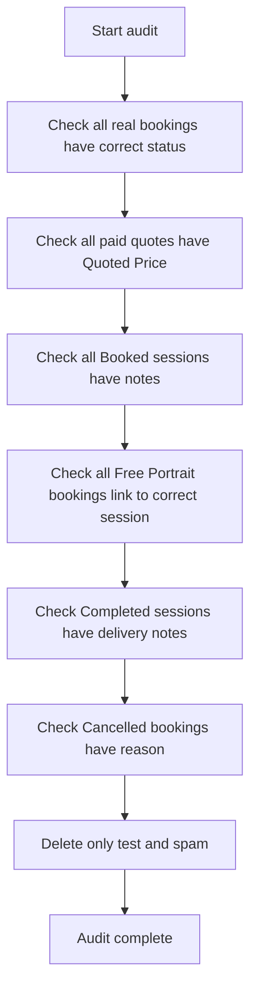

---

## 15. Quick reference

| Situation | Status | Note needed | Delete? |
|---|---|---|---|
| New real enquiry | New then Contacted | Yes | No |
| Contacted customer | Contacted | Yes | No |
| Quote sent | Quoted | Yes, plus price | No |
| Customer confirmed | Booked | Yes | No |
| Session finished | Completed | Yes | No |
| Customer cancelled | Cancelled | Yes | No |
| Customer never replied | Cancelled | Yes | No |
| Free Portrait registration | Booked after confirmation | Yes | No |
| Free Portrait no show | Booked or Cancelled, based on your choice | Yes | No |
| Test booking | Not needed | Not needed | Yes |
| Spam booking | Not needed | Not needed | Yes |
